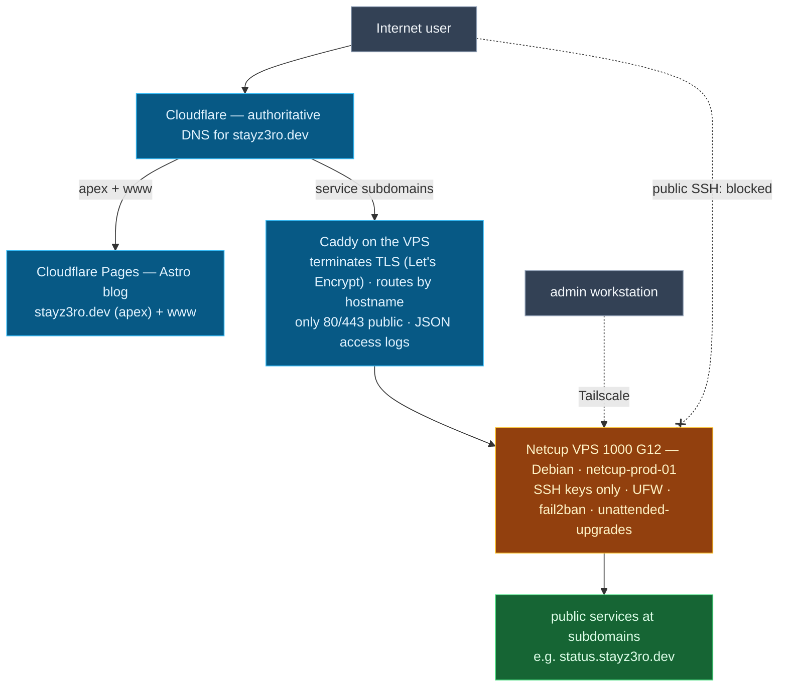

# VPS Cloud Infra — Architecture Overview

One consolidated view of the target architecture. The phase diagrams
([phase 1](phase-1-vps-baseline-security.md),
[phase 2](phase-2-domain-dns-public-routing.md),
[phase 3](phase-3-reverse-proxy-https.md)) carry the detail.

**`stayz3ro.dev` DNS is Cloudflare-authoritative** (Porkbun registrar only).
The **apex + `www` serve the Astro blog** from Cloudflare Pages. **Service
subdomains** (e.g. `status.stayz3ro.dev`) resolve to the VPS, where **Caddy**
terminates TLS and routes by hostname — exactly the ports 80/443 are public,
everything else is Tailscale-only. Backend app containers stay on an internal
Docker network and are never published directly.
