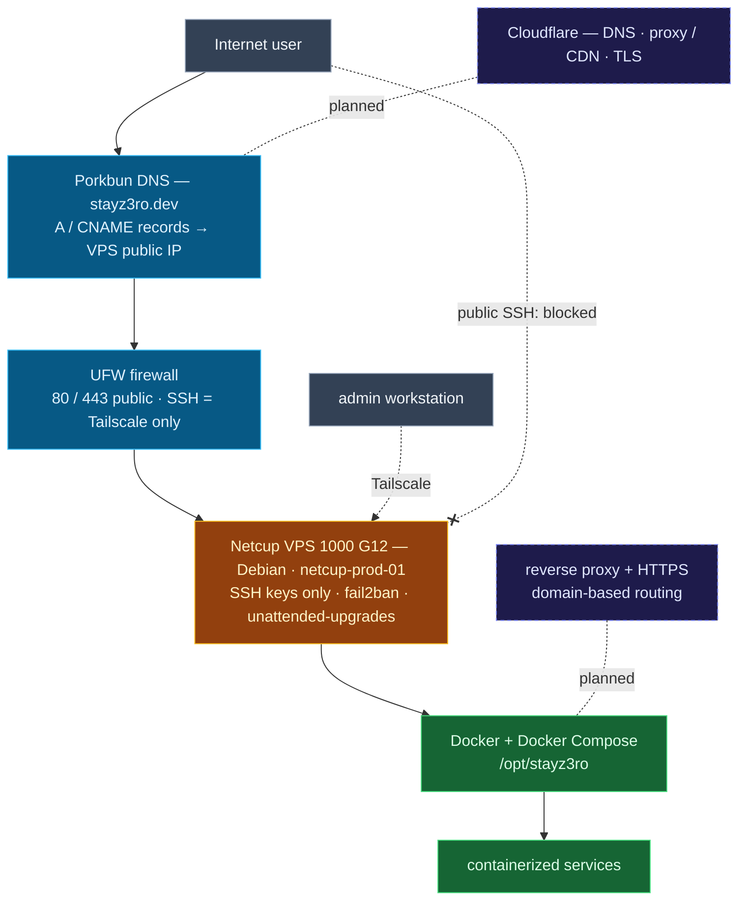

# VPS Cloud Infra — Architecture Overview

A single consolidated view of the current state. The phase diagrams
([phase 1](phase-1-vps-baseline-security.md),
[phase 2](phase-2-domain-dns-public-routing.md)) carry the detail.

**Current:** `stayz3ro.dev` DNS is on **Porkbun**, records point straight at
the VPS public IP; UFW exposes only 80/443, SSH is Tailscale-only, public
SSH is blocked.
**Planned (dashed):** move DNS to Cloudflare (proxy/CDN/TLS) and add a
reverse proxy for HTTPS and domain-based service routing — the portfolio
domain `chrisalorenzo.com` already runs the Cloudflare model.
