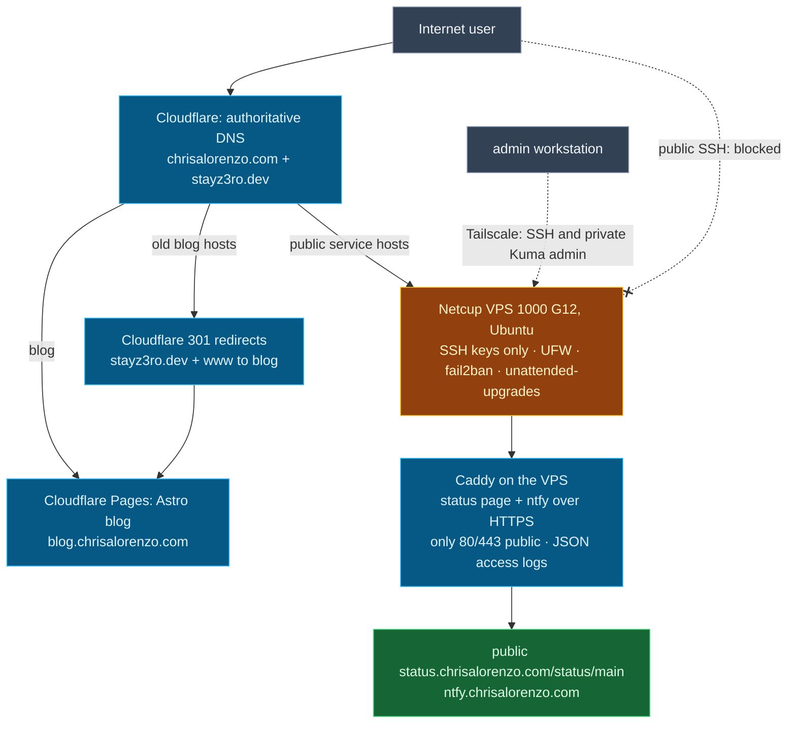

# VPS Cloud Infra: Architecture Overview

One consolidated view of the current architecture as of 2026-10-04. The phase diagrams
([phase 1](phase-1-vps-baseline-security.md),
[phase 2](phase-2-domain-dns-public-routing.md),
[phase 3](phase-3-reverse-proxy-https.md)) carry the detail.

```mermaid
flowchart TD
    USER["Internet user"]
    CF["Cloudflare: authoritative DNS<br/>chrisalorenzo.com + stayz3ro.dev"]
    PAGES["Cloudflare Pages: Astro blog<br/>blog.chrisalorenzo.com"]
    REDIRECT["Cloudflare 301 redirects<br/>stayz3ro.dev + www to blog"]
    CADDY["Caddy on the VPS<br/>status page + ntfy over HTTPS<br/>only 80/443 public · JSON access logs"]
    VPS["Netcup VPS 1000 G12, Ubuntu<br/>SSH keys only · UFW · fail2ban · unattended-upgrades"]
    SVCS["public status.chrisalorenzo.com/status/main<br/>ntfy.chrisalorenzo.com"]
    ADMIN["admin workstation"]

    USER --> CF
    CF -->|blog| PAGES
    CF -->|old blog hosts| REDIRECT
    REDIRECT --> PAGES
    CF -->|public service hosts| VPS
    VPS --> CADDY --> SVCS
    ADMIN -.->|Tailscale: SSH and private Kuma admin| VPS
    USER -. "public SSH: blocked" .-x VPS

    classDef ext fill:#334155,stroke:#94a3b8,color:#f1f5f9
    classDef edge fill:#075985,stroke:#38bdf8,color:#e0f2fe
    classDef host fill:#92400e,stroke:#fbbf24,color:#fef3c7
    classDef svc fill:#166534,stroke:#4ade80,color:#dcfce7
    class USER,ADMIN ext
    class CF,PAGES,REDIRECT,CADDY edge
    class VPS host
    class SVCS svc
```

Cloudflare is authoritative for both zones; Porkbun remains the registrar for
`stayz3ro.dev`. The blog runs on Cloudflare Pages at
`blog.chrisalorenzo.com`, while the old apex and `www` return 301 to it.
`status.stayz3ro.dev` returns 301 to the new status host. Caddy serves
the public status page at `status.chrisalorenzo.com/status/main` and ntfy at
`ntfy.chrisalorenzo.com`; public Kuma admin paths return 404. Kuma admin is
tailnet-only through `tailscale serve` on port 8443. Only ports 80/443 are
public. Backend ports are not publicly exposed; Kuma also binds IPv4 loopback
port 3001 for the private admin path.
