# Phase 1 - Validation Evidence 📸

## Purpose

This page documents the validation evidence for Phase 1: VPS Baseline & Security Hardening.

The goal is to show that the VPS was not only configured, but also verified through command output and redacted screenshots.

---

## Validation Summary

| Area | Validation Result |
|---|---|
| Hostname | Configured and resolving cleanly |
| OS | Ubuntu Linux documented |
| SSH service | Active and running |
| SSH config | Syntax validation passed |
| Firewall | UFW enabled with limited exposure |
| Brute-force protection | Fail2Ban active for SSH |
| Updates | Unattended upgrades enabled |
| Runtime | Docker and Docker Compose installed |
| Private access | Tailscale connected |
| Filesystem | /opt/stayz3ro structure created |
| Ports | Listening services reviewed |

---

## Completion Criteria

Phase 1 is complete because:

| Requirement | Status |
|---|---:|
| Hostname resolves correctly with no sudo warning | ✅ Complete |
| Non-root sudo user works | ✅ Complete |
| SSH service is active | ✅ Complete |
| SSH config validates successfully | ✅ Complete |
| Root SSH login is disabled | ✅ Complete |
| Password SSH login is disabled | ✅ Complete |
| UFW is enabled | ✅ Complete |
| Only SSH, HTTP, and HTTPS are allowed | ✅ Complete |
| Fail2Ban is active for SSH | ✅ Complete |
| Unattended upgrades are enabled | ✅ Complete |
| Docker and Docker Compose work | ✅ Complete |
| Tailscale is installed and connected | ✅ Complete |
| /opt/stayz3ro folder structure exists | ✅ Complete |
| Listening ports are understood and documented | ✅ Complete |

---

# Screenshot Evidence

## 02 - Hostname Validation

Confirms the VPS hostname is configured cleanly as netcup-prod-01.

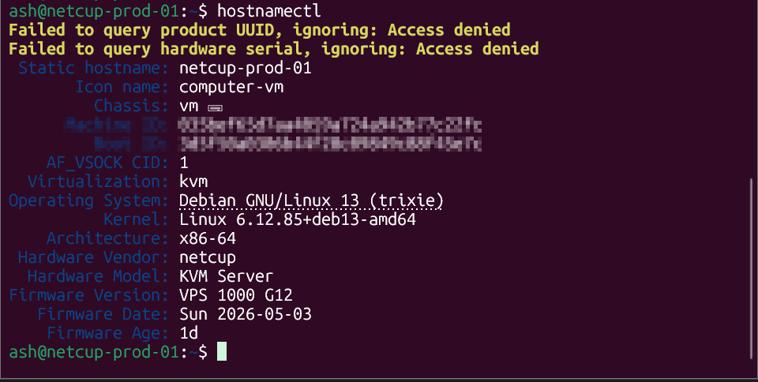

---

## 03 - OS Version

Documents the Ubuntu Linux version used for the VPS baseline.

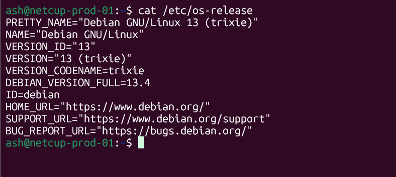

---

## 05 - SSH Service Status

Confirms the SSH service is active and running.

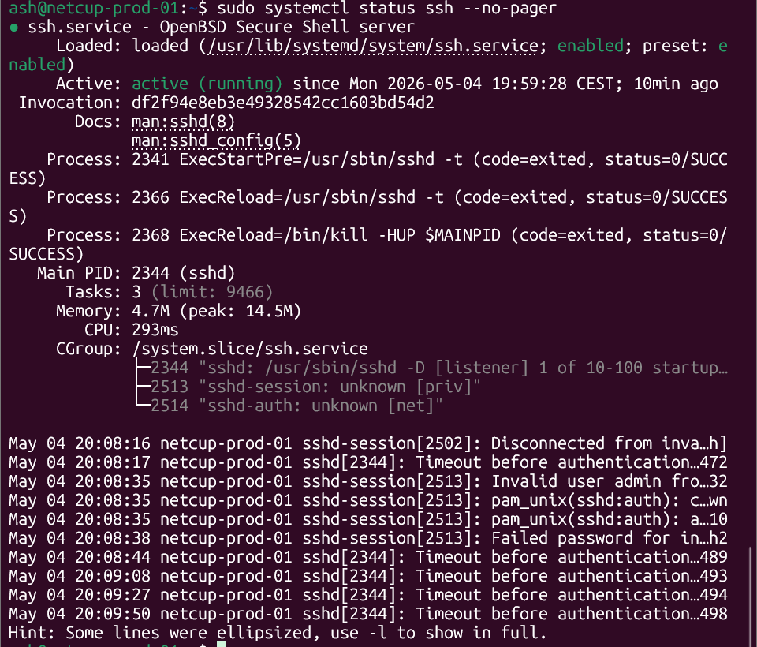

---

## 06 - SSH Config Validation

Confirms the SSH configuration syntax passed validation before reload.

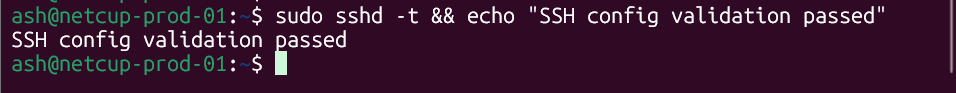

---

## 07 - UFW Firewall Status

Confirms UFW is enabled and only the intended baseline ports are allowed.

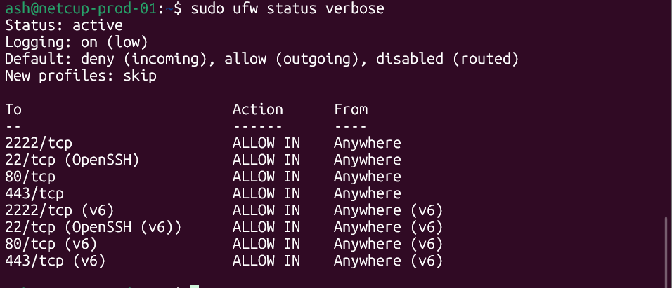

---

## 08 - Fail2Ban Status

Confirms Fail2Ban is active for SSH protection.

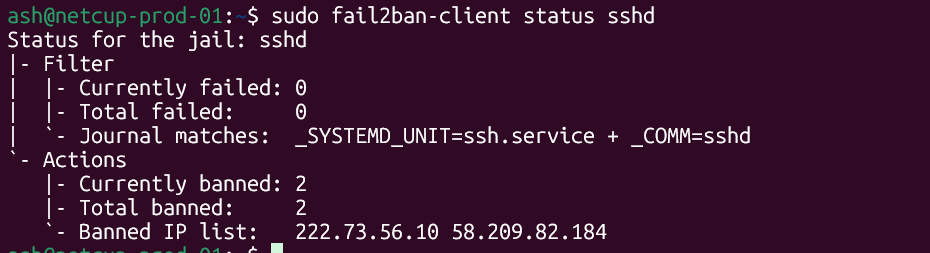

---

## 09 - Unattended Upgrades

Confirms unattended upgrades are enabled for automatic security updates.

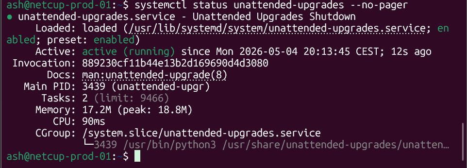

---

## 10 - Swap and Memory Check

Confirms system memory and swap status after baseline configuration.

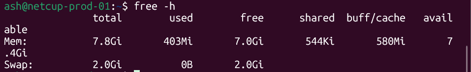

---

## 11 - Docker Validation

Confirms Docker and Docker Compose are installed and available.

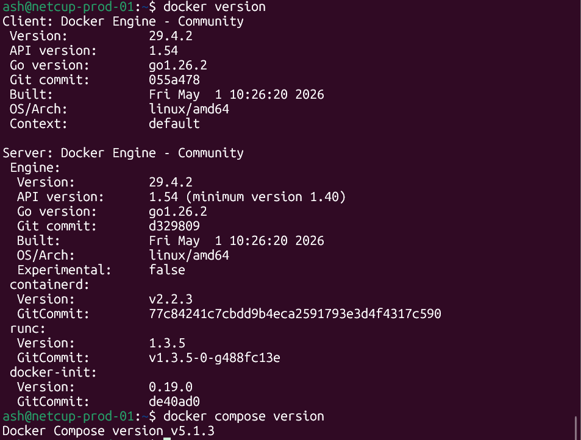

---

## 12 - Tailscale Status

Confirms the VPS is connected to Tailscale for private administrative access.

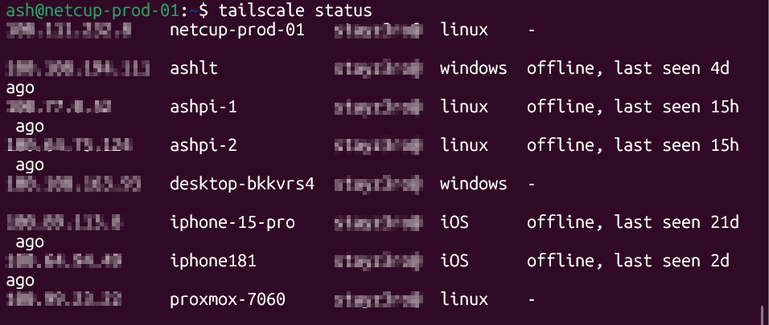

---

## 13 - VPS Folder Structure

Confirms the /opt/stayz3ro folder structure was created for future services.

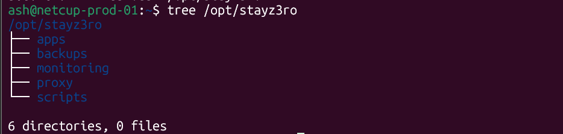

---

## 14 - Listening Ports

Confirms listening services were reviewed before public app deployment.

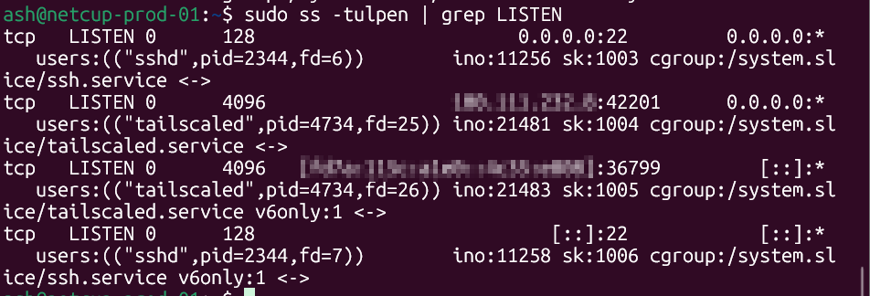

---

## Optional Evidence Not Included

| Evidence | Reason |
|---|---|
| Netcup VPS dashboard | Omitted to avoid exposing provider/account details |
| Sudo user group screenshot | Verified during setup but not included in this screenshot set |

---

## Redaction Rules

The following information was redacted or excluded before committing screenshots:

| Sensitive Item | Handling |
|---|---|
| Public IPv4 address | Redacted or excluded |
| IPv6 address | Redacted or excluded |
| Tailscale IPs | Redacted |
| Tailscale device identifiers | Redacted where needed |
| Netcup account details | Excluded |
| Email addresses | Redacted or excluded |
| Authentication URLs | Excluded |
| API keys or tokens | Excluded |
| SSH keys | Excluded |
| Billing details | Excluded |

---

## Validation Result

Phase 1 is validated.

The VPS has a secure baseline and is ready for the next phase:

**Phase 2 - Domain DNS & Public Routing**
