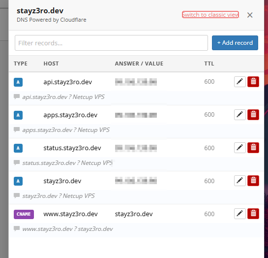
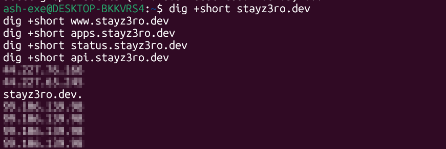
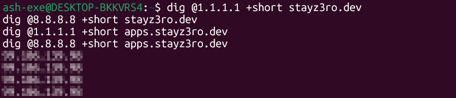
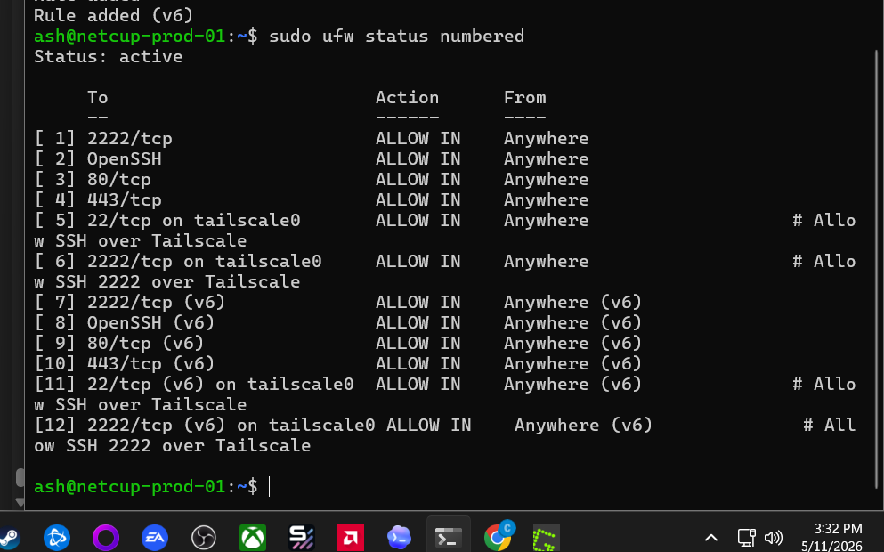
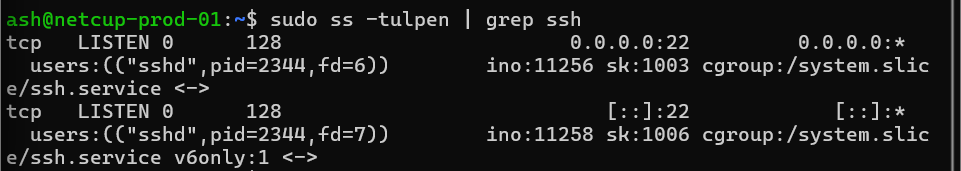
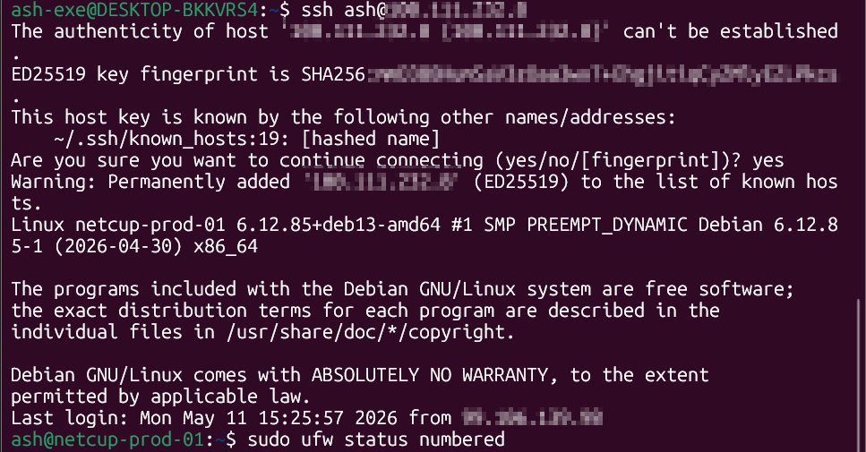
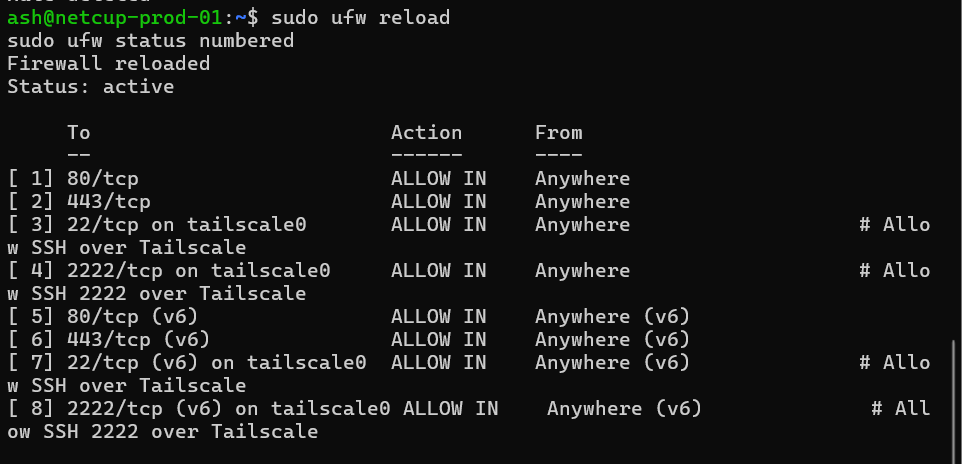
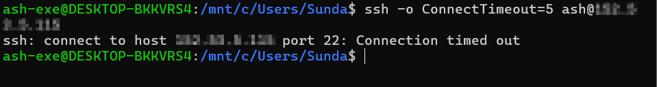

# Phase 2 - Validation Evidence 📸

## Purpose

This page documents validation evidence for Phase 2: Domain DNS & Public Routing.

The goal was to confirm that `stayz3ro.dev` resolves to the Netcup VPS and that administrative SSH access is restricted to the private Tailscale network.

---

## Validation Summary

| Area | Result |
|---|---|
| Root domain | Resolves to Netcup VPS |
| www record | Resolves through CNAME/root domain |
| apps subdomain | Resolves to Netcup VPS |
| status subdomain | Resolves to Netcup VPS |
| api subdomain | Resolves to Netcup VPS |
| Public resolvers | Cloudflare and Google DNS validated |
| Public SSH | Blocked |
| Tailscale SSH | Working |
| HTTP/HTTPS | Publicly allowed for future reverse proxy |
| Direct app ports | Not exposed |

---

## Completion Criteria

| Requirement | Status |
|---|---:|
| Porkbun parking records removed | ✅ Complete |
| Root domain A record configured | ✅ Complete |
| www record configured | ✅ Complete |
| apps subdomain configured | ✅ Complete |
| status subdomain configured | ✅ Complete |
| api subdomain configured | ✅ Complete |
| Local DNS resolution validated | ✅ Complete |
| Public resolver validation completed | ✅ Complete |
| SSH works over Tailscale | ✅ Complete |
| Public SSH is blocked | ✅ Complete |
| UFW confirms Tailscale-only SSH | ✅ Complete |
| DNS and security screenshots captured | ✅ Complete |

---

# Screenshot Evidence

## 01 - Porkbun DNS Records

Confirms DNS records were configured for the root domain and planned service subdomains.

---

## 02 - Local DNS Resolution

Confirms local `dig +short` lookups resolve the domain and subdomains.

---

## 03 - Public Resolver Validation

Confirms public resolvers return the expected DNS records.

---

## 04 - UFW Before SSH Cleanup

Shows the firewall state before removing public SSH rules.

---

## 05 - SSH Listening Port

Confirms the SSH service listening state before final validation.

---

## 06 - Tailscale SSH Access Success

Confirms SSH works over the VPS Tailscale IP.

---

## 07 - Final UFW Tailscale-Only SSH

Confirms SSH is allowed only over the Tailscale interface while HTTP and HTTPS remain public.

---

## 08 - Public SSH Blocked

Confirms SSH to the public VPS IP fails.

---

## Redaction Rules

The following values were redacted or excluded before committing screenshots:

| Sensitive Item | Handling |
|---|---|
| Public IPv4 address | Redacted |
| Tailscale IP | Redacted |
| IPv6 address | Redacted or excluded |
| Porkbun account details | Excluded |
| Email addresses | Redacted or excluded |
| API access details | Excluded |
| Billing details | Excluded |
| SSH host fingerprints | Redacted where visible |

---

## Validation Result

Phase 2 is validated.

The domain DNS foundation is ready, and administrative SSH is restricted to Tailscale.

The VPS is ready for the next phase:

**Phase 3 - Reverse Proxy & HTTPS**
