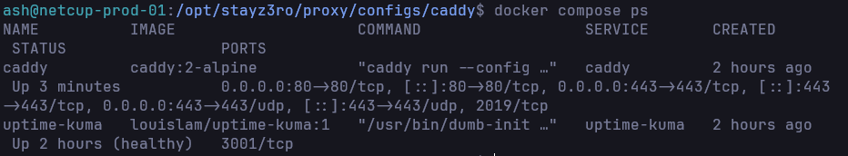
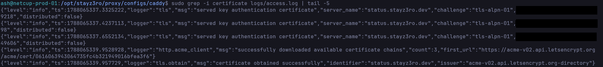
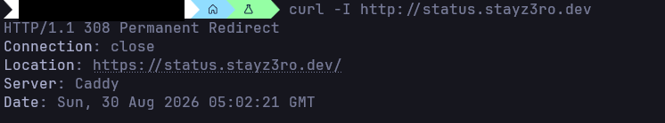
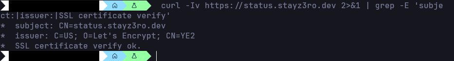
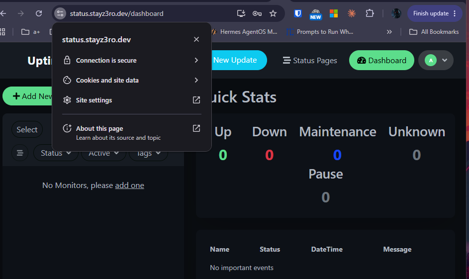
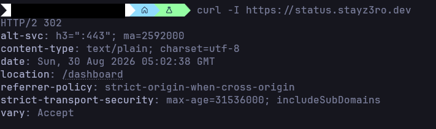
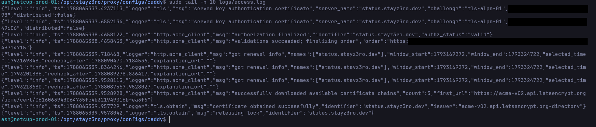
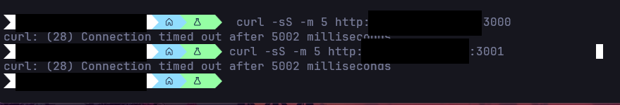
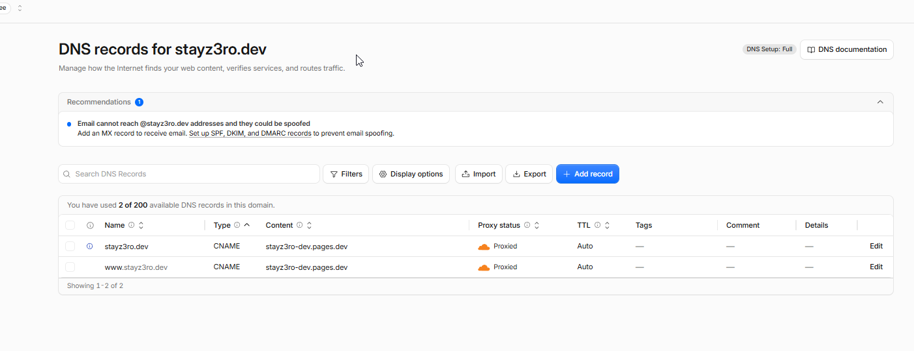

# Phase 3 - Validation Evidence 📸

## Purpose

This page documents validation evidence for Phase 3: Reverse Proxy & HTTPS.

The deploy ran on 2026-08-30 on `netcup-prod-01` (all 11 runbook steps), and
the evidence below was captured during that session and redacted afterward.
It confirms that `https://status.stayz3ro.dev` is publicly reachable with a
valid certificate, that HTTP redirects to HTTPS, that security headers and
structured logging are in place, and that no backend port is exposed
publicly.

---

## Validation Summary

| Area | Expected Result | Status |
|---|---|---|
| Caddy container | Running, ports 80/443/443-udp published | ✅ Confirmed |
| Uptime Kuma container | Running (healthy), no published port | ✅ Confirmed |
| Certificate | Issued by Let's Encrypt for `status.stayz3ro.dev` (`tls-alpn-01`, multi-perspective validation) | ✅ Confirmed |
| HTTP -> HTTPS | `http://status.stayz3ro.dev` returns 308 to HTTPS | ✅ Confirmed |
| HTTPS | Valid Let's Encrypt chain; Uptime Kuma UI loads in the browser | ✅ Confirmed |
| Security headers | HSTS (1 year, includeSubDomains), Referrer-Policy, nosniff, DENY present; `Server` not advertised on HTTPS responses | ✅ Confirmed |
| Access log | JSON entries in `configs/caddy/logs/access.log` | ✅ Confirmed |
| Backend ports | 3000 / 3001 not reachable on the public IP | ✅ Confirmed |
| Admin secured pre-exposure | Uptime Kuma admin account created over a private SSH tunnel before the certificate made the hostname discoverable | ✅ Confirmed (deploy record - no screenshot by design, the tunnel is not captured) |

---

## Completion Criteria

| Requirement | Status |
|---|---:|
| Reverse proxy chosen and justified | ✅ Complete |
| Caddy stack committed | ✅ Complete |
| Uptime Kuma service defined in compose | ✅ Complete |
| Stack deployed on the VPS | ✅ Complete |
| Certificate issued for `status.stayz3ro.dev` | ✅ Complete |
| HTTP redirects to HTTPS | ✅ Complete |
| External HTTPS validated (curl + browser) | ✅ Complete |
| Security headers verified | ✅ Complete |
| JSON access log confirmed | ✅ Complete |
| Backend ports confirmed private | ✅ Complete |
| Redacted screenshots captured | ✅ Complete |

---

# Screenshot Evidence

## 01 - Container Running

Caddy and Uptime Kuma both up; only Caddy publishes ports (80, 443,
443/udp) - no application port is published to the host.

## 02 - Certificate Issuance (access log)

Let's Encrypt issued the certificate for `status.stayz3ro.dev` via the
`tls-alpn-01` challenge. Sourced from `access.log` via
`sudo grep -i certificate logs/access.log` - not `docker compose logs`,
because this Caddyfile redirects Caddy's own logging to the file (see
Lessons Learned). ACME validation remotes and the order URL are redacted.

## 03 - HTTP 308 Redirect

Plain HTTP redirects to HTTPS with `308 Permanent Redirect`.

## 04 - Valid Certificate Chain

`curl -Iv` shows the subject `CN=status.stayz3ro.dev`, the Let's Encrypt
issuer, and successful verification.

## 05 - Browser Padlock, Uptime Kuma Loaded

The browser confirms `Connection is secure` on
`status.stayz3ro.dev`, with the Uptime Kuma dashboard served behind Caddy.

## 07 - Security Headers

The HTTPS response carries `strict-transport-security`
(`max-age=31536000; includeSubDomains`) and
`referrer-policy: strict-origin-when-cross-origin`, and does not advertise
the server software.

## 08 - JSON Access Log

`tail -n 10 logs/access.log` shows structured JSON log entries - one per
request/TLS event - written to the bind-mounted log directory.

## 09 - Backend Ports Not Public

External probes against ports 3000 (former app port) and 3001 (Uptime
Kuma) both time out - only 80 and 443 answer on the public IP. The probed
IP in the commands is redacted.

## 10 - Cloudflare Zone (DNS Zone Mismatch, Bonus)

The deploy's real blocker: `stayz3ro.dev`'s live zone lives in Cloudflare,
not Porkbun's panel. This is the live Cloudflare zone as found during the
deploy - only the blog CNAME records, no `status` A record yet. The record
was added here (Cloudflare), after which ACME issuance succeeded.

---

## Redaction Rules

| Sensitive Item | Handling |
|---|---|
| Public IPv4 address | Redacted |
| Public IPv6 address | Redacted or excluded |
| Tailscale IP | Redacted |
| Admin workstation hostname | Redacted |
| ACME / account email | Redacted |
| ACME order URLs (contain the account ID) | Redacted |
| Let's Encrypt validation remotes | Redacted by default |
| SSH host fingerprints | Redacted where visible |
| Provider account data | Excluded |

---

## Validation Result

Phase 3 is validated end to end. The HTTPS edge works as designed: a single
TLS-terminating Caddy serves `status.stayz3ro.dev` with an automatically
issued and renewed Let's Encrypt certificate, redirects HTTP to HTTPS,
emits JSON access logs, and keeps every backend port off the public
internet. The deploy also surfaced and fixed the DNS zone mismatch
documented in `LESSONS-LEARNED.md`, and closed Uptime Kuma's
first-run-setup race window before the certificate made the hostname
publicly discoverable.
